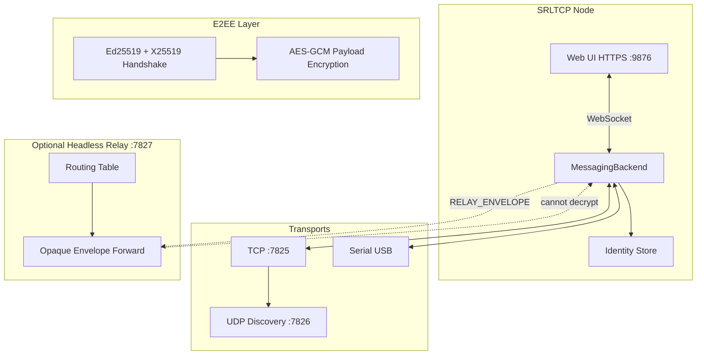

# SRLTCP

[](https://github.com/narl3yyy-svg/SRLTCP/actions/workflows/checks.yml)
[](LICENSE)
[](https://www.python.org/downloads/)

**SRLTCP** (Serial + Relay-Less TCP) is a fast, secure, peer-to-peer communication and file transfer system. It runs over **USB Serial** and **TCP/IP**, supports direct P2P mode, and optionally uses a lightweight **headless relay server** that routes traffic without decrypting end-to-end encrypted payloads.

**Current version:** 0.1.5

---

## Features

| Feature | Description |
|---------|-------------|
| **Dual transports** | TCP/IP networking + USB Serial (pyserial) |
| **P2P mode** | Direct encrypted links between peers on LAN or serial cable |
| **Relay mode** | Optional headless server forwards opaque E2EE envelopes |
| **Secure messaging** | Ed25519 identity + X25519 key exchange + AES-GCM |
| **Fast file transfer** | 4 MiB chunked streaming, zstd compression, resume support |
| **Folder sharing** | Token-based HTTP browse/download API |
| **Web UI** | Localhost **HTTPS-only** chat UI (default port **9876**) |
| **Settings** | First-run wizard + persistent config (folders, retention, LAN IP) |
| **System stats** | CPU usage & temperature in the web UI status bar |
| **Trusted peers** | Trust-before-message security model |
| **Ping / RTT** | Latency in ms; serial RF link quality % |
| **Cross-platform** | Linux, macOS, Windows CLI + Android (Chaquopy) |

---

## Architecture

SRLTCP uses a modular package layout inspired by [chatx5](https://github.com/narl3yyy-svg/chatx5):

```
srltcp/
  app.py                    # CLI entry point
  core/
    identity.py             # Per-transport Ed25519 identities
    discovery.py            # UDP/TCP peer discovery registry
    node.py                 # Top-level node (messaging + sharing)
    protocol/
      framing.py            # Length + CRC32 frames
      messages.py           # Binary message types
      crypto.py             # E2EE: Ed25519, X25519, AES-GCM
    messaging/              # Mixin-composed backend
      backend.py            # Orchestrator
      links.py              # Peer link map
      connect.py            # Handshake + session keys
      announce.py           # Discovery broadcasts
      queue.py              # Offline message queue
      transfer.py           # Chunked file transfer
      routing.py            # Relay routing table
      relay.py              # Opaque envelope forwarding
  transports/
    tcp.py                  # TCP listener + UDP discovery
    serial.py               # USB serial (pyserial)
  web/                      # Local UI (aiohttp + WebSocket)
  routes/                   # REST + share + WS routes
  utils/                    # Logging, files, platform helpers
```

### Data flow diagram



### Wire protocol

Every transport uses the same framed binary protocol:

```
┌──────────┬──────────┬──────────┬─────────────────┐
│ SRL\x01  │ length   │ CRC32    │ payload         │
│ (magic)  │ (4 BE)   │ (4 BE)   │ (variable)      │
└──────────┴──────────┴──────────┴─────────────────┘
```

Payload structure:

```
┌──────────┬───────┬───────────┬─────┬──────────────┐
│ msg_type │ flags │ stream_id │ seq │ body         │
│ (1 byte) │ (1)   │ (4 BE)    │ (4) │ (JSON/binary)│
└──────────┴───────┴───────────┴─────┴──────────────┘
```

File chunks use a binary body: `transfer_id (16) + offset (8) + length (4) + data`.

---

## Security model

### Identity

Each transport (TCP, Serial) has its own **Ed25519 keypair**. The node hash ID is the first 32 hex chars of `SHA-256(public_key)` — similar to Reticulum-style addressing.

Identities are stored in `~/.srltcp/identities/` (or `%APPDATA%\SRLTCP` on Windows).

### End-to-end encryption

1. **Handshake** — Ephemeral X25519 keys, signed by Ed25519 identity keys
2. **Session keys** — HKDF-derived AES-256 keys (separate send/recv)
3. **Payloads** — AES-GCM with 12-byte nonces; all messages and file metadata encrypted
4. **File chunks** — Encrypted per-chunk; optional zstd compression (flag bit)

### Relay privacy

In relay mode, the server forwards `RELAY_ENVELOPE` packets containing only:

- A 16-byte route token (destination hash prefix)
- An opaque encrypted blob

The relay **never receives session keys** and cannot decrypt message or file content.

### Web UI hardening (v0.1.1+)

- **HTTPS only** on `127.0.0.1` — auto-generated 4096-bit localhost certificate
- **TLS 1.2+** with modern cipher suites; no cleartext HTTP
- **Localhost-only binding** — refuses non-loopback Host headers
- **Security headers** — CSP, HSTS, `X-Frame-Options: DENY`, `no-referrer`
- **Origin validation** on POST requests and WebSocket connections
- **Path traversal protection** on file/share APIs
- **Constant-time** token comparison for share sessions

### First-run setup

On first launch, the web UI shows a setup wizard. Settings persist in `~/.srltcp/settings.json`:

| Setting | Description |
|---------|-------------|
| Display name | Shown to peers on the network |
| Web port | HTTPS port (default **9876**); restart to apply |
| Message retention | Hours to keep local chat history |
| Incoming files folder | Where received files are saved |
| Shared folder | Default folder for browse/share |
| LAN IP | Pinned interface for discovery & announce |
| Auto-announce | Broadcast presence every 5 seconds |

Change port from CLI: `./run.sh web --port 9999`

---

## Installation

### Linux / macOS

```bash
git clone https://github.com/narl3yyy-svg/SRLTCP.git
cd SRLTCP
./run.sh web
```

Open **https://127.0.0.1:9876** in your browser (self-signed cert — accept once for localhost).

Press **Ctrl+C** in the terminal to shut down cleanly.

For USB serial on Linux, add your user to the `dialout` group:

```bash
sudo usermod -aG dialout $USER
# log out and back in
./run.sh web --serial
```

### Windows

```cmd
git clone https://github.com/narl3yyy-svg/SRLTCP.git
cd SRLTCP
run.bat web
```

Requires [Python 3.12+](https://www.python.org/downloads/) with **Add to PATH** checked.

### pip install

```bash
pip install -e .
srltcp web
```

### Android (Chaquopy)

See [android/README.md](android/README.md). Build the APK with Android Studio + Gradle:

```bash
cd android
./gradlew assembleDebug
```

Sideload `app-debug.apk` on arm64 devices with USB-OTG support.

---

## Usage

### P2P mode (default)

Start the web UI on two machines on the same LAN:

```bash
# Machine A
./run.sh web --name "alice"

# Machine B
./run.sh web --name "bob"
```

1. Click **Announce** on both machines
2. Select a discovered peer in the sidebar
3. Send encrypted messages in the chat panel

### Headless relay server

Run a 24/7 relay on a VPS or always-on LAN host:

```bash
./run.sh relay --bind 0.0.0.0 --port 7827
```

Clients connect through the relay with E2EE — the relay only routes opaque envelopes:

```bash
./run.sh web --relay --name "client-a"
```

### USB Serial P2P

Connect two machines via USB-serial cable (or USB-OTG):

```bash
# Machine A
./run.sh web --serial --serial-port /dev/ttyUSB0 --no-tcp

# Machine B
./run.sh web --serial --serial-port /dev/ttyACM0 --no-tcp
```

### CLI messaging

```bash
srltcp send --recipient <hash_id> --text "Hello" --host 10.0.0.5
```

### File transfer (API)

```bash
# Send a file to a connected peer
curl -k -X POST https://127.0.0.1:9876/api/transfer \
  -H 'Content-Type: application/json' \
  -d '{"recipient_hash":"<hash>","path":"/path/to/large.iso"}'

# List transfers
curl -k https://127.0.0.1:9876/api/transfers
```

Transfers are **resumable** — if interrupted, the receiver's partial file offset is used on resume via `FILE_RESUME`.

### Folder sharing

```bash
curl -k -X POST https://127.0.0.1:9876/api/share/create \
  -H 'Content-Type: application/json' \
  -d '{"path":"/home/user/shared"}'

# Browse (from peer)
curl -k "https://127.0.0.1:9876/api/share/<session_id>/list?token=<token>"
```

---

## Performance notes

| Setting | Value | Rationale |
|---------|-------|-----------|
| Chunk size | 4 MiB | Maximizes throughput on gigabit LAN |
| Compression | zstd level 3, ≥ 64 KiB | Fast ratio for text/logs; skips already-compressed data |
| Frame CRC | CRC32 | Cheap integrity check per frame |
| Async I/O | aiofiles + asyncio | Non-blocking disk and network |
| Memory | Streaming only | Never loads full file into RAM |

**Tips for maximum speed:**

- Use wired Ethernet or USB 3 serial adapters at 115200+ baud
- Prefer direct P2P over relay (one less hop)
- Disable compression for pre-compressed archives (future: per-file flag)
- Run relay on a low-latency host close to all peers

---

## Development

```bash
python -m venv .venv && source .venv/bin/activate
pip install -e ".[dev]"
pre-commit install  # optional

./run.sh web                    # dev server
bash scripts/check.sh           # ruff + pytest
pytest tests/ -v                # unit tests only
```

### Project commands

| Command | Description |
|---------|-------------|
| `srltcp web` | Web UI + P2P node |
| `srltcp relay` | Headless relay server |
| `srltcp send` | One-shot CLI message |
| `srltcp identity` | Show local hash IDs |

---

## Changelog

See [srltcp/RELEASE_NOTES.md](srltcp/RELEASE_NOTES.md). Click the version badge in the status bar for release notes.

### v0.1.4

- Ctrl+C now exits promptly (WebSocket + transport teardown)
- APK build fixed for Chaquopy 15 Gradle DSL

### v0.1.3

- Handshake UI and reconnect fixes; RTT shown when connected
- Serial port and baud rate dropdowns (USB devices)
- Self-node removed from discovered peers; APK build fixed

### v0.1.2

- Fixed discovery spam; auto-announce off by default with passive discovery
- Trusted peers required for messaging and file transfer
- Ping/RTT (ms) and serial RF link quality (%)
- File upload via browser with progress bar and MB/s speed
- Settings: serial transport, folder pickers, retention presets, restart
- Identity create/regenerate/delete for TCP and serial

## Roadmap

- [ ] Multi-hop relay with source routing and loop prevention
- [ ] Android USB serial Chaquopy shim (full OTG support)
- [ ] Folder sync (bidirectional, incremental)
- [ ] Contact book with pinned peer hashes
- [ ] Noise protocol framework option for handshake
- [ ] QUIC transport backend
- [ ] Bandwidth limiting and QoS per transfer
- [ ] Signed release APK on GitHub Releases
- [ ] Desktop system tray wrapper (Tauri/Electron)

---

## License

GPL v3 — see [LICENSE](LICENSE).

## Acknowledgments

Architecture patterns adapted from [chatx5](https://github.com/narl3yyy-svg/chatx5). Identity hashing inspired by [Reticulum](https://reticulum.network/).