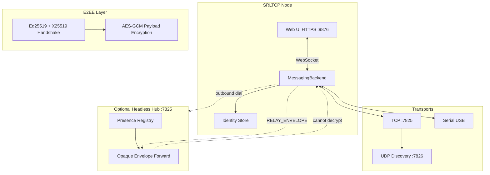

# SRLTCP

[](LICENSE)
[](https://www.python.org/downloads/)

**SRLTCP** (Serial + Relay-Less TCP) is a fast, secure, peer-to-peer communication and file transfer system. It runs over **USB Serial** and **TCP/IP**, supports direct P2P on LAN, and optionally connects clients through a **headless hub server** so users do not need router port-forwarding. The hub forwards opaque encrypted traffic and cannot read messages.

**Current version:** 0.1.53

---

## Features

| Feature | Description |
|---------|-------------|
| **Dual transports** | TCP/IP networking + USB Serial (pyserial) |
| **P2P mode** | Direct encrypted links between peers on LAN or serial cable |
| **Hub server** | Optional headless hub — clients dial out, discover each other, E2EE via hub |
| **Secure messaging** | Ed25519 identity + X25519 key exchange + AES-GCM |
| **Fast file transfer** | Chunked streaming (1 MiB TCP / 8 KiB serial), zstd on TCP, resume support |
| **Folder sharing** | E2EE peer shares + optional token-based HTTP API |
| **Drag-and-drop send** | Drop files onto a contact in the Web UI |
| **WAN / manual peers** | Host + port per trusted contact; encrypted TCP 7825 |
| **Web UI** | Localhost **HTTPS-only** chat UI (default port **9876**) |
| **Settings** | First-run wizard + persistent config (folders, retention, LAN IP) |
| **System stats** | CPU usage & temperature in the web UI status bar |
| **Trusted peers** | Trust-before-message security model |
| **Ping / RTT** | Latency in ms; serial link quality % (RTT-based estimate, not RF RSSI) |
| **Cross-platform** | Linux, macOS, Windows CLI + Android (Chaquopy APK) |

---

## Architecture

SRLTCP uses a modular package layout inspired by [chatx5](https://github.com/narl3yyy-svg/chatx5):

```
srltcp/
  app.py                    # CLI entry point
  core/
    identity.py             # Per-transport Ed25519 identities
    discovery.py            # UDP/TCP peer discovery registry
    node.py                 # Top-level node (messaging + sharing)
    protocol/
      framing.py            # Length + CRC32 frames
      messages.py           # Binary message types
      crypto.py             # E2EE: Ed25519, X25519, AES-GCM
    messaging/              # Mixin-composed backend
      backend.py            # Orchestrator
      links.py              # Peer link map
      connect.py            # Handshake + session keys
      announce.py           # Discovery broadcasts
      queue.py              # Offline message queue
      transfer.py           # Chunked file transfer
      hub.py                # Hub client + server forwarding
      presence.py           # Hub presence registry
  transports/
    tcp.py                  # TCP listener + UDP discovery
    serial.py               # USB serial (pyserial)
  web/                      # Local UI (aiohttp + WebSocket)
  routes/                   # REST + share + WS routes
  utils/                    # Logging, files, platform helpers
android/                    # Gradle + Chaquopy Android app (see android/README.md)
tests/                      # pytest suite
scripts/                    # Build helpers (check.sh, build-android.sh, sync-android-python.sh)

```

### Data flow diagram



### Wire protocol

Every transport uses the same framed binary protocol:

```
┌──────────┬──────────┬──────────┬─────────────────┐
│ SRL\x01  │ length   │ CRC32    │ payload         │
│ (magic)  │ (4 BE)   │ (4 BE)   │ (variable)      │
└──────────┴──────────┴──────────┴─────────────────┘
```

Payload structure:

```
┌──────────┬───────┬───────────┬─────┬──────────────┐
│ msg_type │ flags │ stream_id │ seq │ body         │
│ (1 byte) │ (1)   │ (4 BE)    │ (4) │ (JSON/binary)│
└──────────┴───────┴───────────┴─────┴──────────────┘
```

File chunks use a binary body: `transfer_id (16) + offset (8) + length (4) + data`.

---

## Security model

### Identity

Each transport (TCP, Serial) has its own **Ed25519 keypair**. The node hash ID is the first 32 hex chars of `SHA-256(public_key)` — similar to Reticulum-style addressing.

Identities are stored in `~/.srltcp/identities/` (or `%APPDATA%\SRLTCP` on Windows).

### End-to-end encryption

1. **Handshake** — Ephemeral X25519 keys, signed by Ed25519 identity keys
2. **Session keys** — HKDF-derived AES-256 keys (separate send/recv) via HKDF-SHA256 with labels `srltcp-v2-send` / `srltcp-v2-recv`
3. **Payloads** — AES-256-GCM with 12-byte nonces; all chat text, file offers, and metadata are encrypted (`Flags.ENCRYPTED | Flags.E2EE`)
4. **File chunks** — Each chunk is encrypted before it leaves your node; TCP may apply zstd compression **before** encryption (flag bit). Larger 1 MiB TCP chunks improve throughput only — they do **not** weaken encryption.

### How data is transferred

| Path | What travels on the wire | Encrypted? |
|------|--------------------------|------------|
| **TCP / WAN (port 7825)** | Framed binary protocol after handshake | Yes — payloads are opaque AES-GCM blobs |
| **USB Serial** | Same framed protocol over serial | Yes — identical E2EE session |
| **UDP discovery (7826)** | Peer announces (hash, name, endpoints) | No — discovery metadata is plaintext on LAN |
| **Web UI (9876)** | Browser ↔ local node over HTTPS | Localhost TLS only; chat/file APIs proxy local data |
| **Hub (optional 7825)** | `RELAY_ENVELOPE` routing tokens + opaque blob | Hub sees hash routing tokens only, not content |

**File transfer flow:** upload to local staging → `FILE_OFFER` (encrypted JSON) → `FILE_ACCEPT` → encrypted `FILE_CHUNK` stream → `FILE_COMPLETE` with SHA-256 verify. The receiver writes to your configured incoming folder; the Web UI serves completed files from disk for preview/download.

**WAN use:** Forward **TCP 7825** to your node. Traffic after handshake is E2EE. An observer on the internet can still see connection timing, packet sizes, and your public IP — verify peer hash IDs out-of-band before trusting. Set WAN host/port per contact (Add contact or contact menu → WAN).

### Hub privacy

When using a hub, the server forwards `RELAY_ENVELOPE` packets containing only:

- 16-byte binary routing tokens (destination and source identity hashes)
- An opaque encrypted blob (handshake, chat, file chunks — all E2EE)

The hub **never receives session keys** and cannot decrypt message or file content. Hub registration is signed with your Ed25519 identity to reduce presence spoofing.

### What is not encrypted

- LAN/UDP discovery announces (names, IPs, ports)
- Hub presence (who is online on a hub — names and hash IDs)
- Hub routing metadata (identity hash tokens, timing, approximate sizes)
- Connection metadata (who talks to whom, when)
- Local settings, trusted-peer list, and chat history on disk
- Self-signed localhost HTTPS certificate (browser trust is manual)

See [SECURITY.md](SECURITY.md) for vulnerability reporting, hub operator guidance, and hardening.

### Web UI hardening (v0.1.1+)

- **HTTPS only** on `127.0.0.1` — auto-generated 4096-bit localhost certificate
- **TLS 1.2+** with modern cipher suites; no cleartext HTTP
- **Localhost-only binding** — refuses non-loopback Host headers
- **Security headers** — CSP, HSTS, `X-Frame-Options: DENY`, `no-referrer`
- **Origin validation** on POST requests and WebSocket connections
- **Path traversal protection** on file/share APIs
- **Constant-time** token comparison for share sessions

### First-run setup

On first launch, the web UI shows a setup wizard. Settings persist in `~/.srltcp/settings.json`:

| Setting | Description |
|---------|-------------|
| Display name | Shown to peers on the network |
| Web port | HTTPS port (default **9876**); restart to apply |
| Message retention | Hours to keep local chat history |
| Incoming files folder | Where received files are saved |
| Shared folder | Default folder for browse/share |
| LAN IP | Pinned interface for discovery & announce |
| Auto-announce | Broadcast presence every 5 seconds (LAN only; hub clients re-register on hub when enabled) |
| Connect via hub | Enable outbound connection to a shared hub server (no client port-forward) |
| Hub host / port | Public address of the headless hub (default port **7825**) |
| WAN port-forward | Advanced: acknowledge you will forward TCP **7825** for direct WAN peers |
| Timezone | Region for the status clock (time shown at top of sidebar) |
| Show clock | Toggle live clock in the UI |

Change port from CLI: `./run.sh web --port 9999`

---

## Installation

### Linux / macOS

```bash
git clone https://github.com/narl3yyy-svg/SRLTCP.git
cd SRLTCP
./run.sh web
# Verbose backend logs:
./run.sh web --debug
```

Open **https://127.0.0.1:9876** in your browser (self-signed cert — accept once for localhost).

Press **Ctrl+C** in the terminal to shut down cleanly.

For USB serial on Linux, add your user to the `dialout` group:

```bash
sudo usermod -aG dialout $USER
# log out and back in
./run.sh web --serial
```

### Windows

```cmd
git clone https://github.com/narl3yyy-svg/SRLTCP.git
cd SRLTCP
run.bat web
```

Requires [Python 3.12+](https://www.python.org/downloads/) with **Add to PATH** checked.

### pip install

```bash
pip install -e .
srltcp web
```

### Android (Gradle + Chaquopy)

See [android/README.md](android/README.md). The APK embeds the same `srltcp/` Python code via **Chaquopy** — built **locally** with Gradle (no cloud CI).

**Prerequisites**

| Tool | Notes |
|------|--------|
| **JDK 17** | `export JAVA_HOME=/usr/lib/jvm/java-17-openjdk` |
| **Android SDK API 34** | Platform + build-tools 34.x |
| **Python 3.12** | Used by Chaquopy to compile the embedded runtime |
| **adb** | USB debugging enabled on the phone |

```bash
export ANDROID_HOME="$HOME/Android/Sdk"
export PATH="$PATH:$ANDROID_HOME/platform-tools"
```

**Clean rebuild (recommended after Python or Android changes)**

```bash
cd /path/to/SRLTCP
bash scripts/sync-android-python.sh          # copy srltcp/ into the APK tree
cd android
rm -rf app/build .gradle build               # remove old build artifacts
./gradlew clean
./gradlew assembleDebug renameDebugApk
```

Output: `android/app/build/outputs/apk/debug/SRLTCP-0.1.53.apk`

**One-command build** (sync + Gradle): `bash scripts/build-android.sh`

**Install on a connected device**

```bash
adb uninstall com.srltcp.app                 # optional — fresh install
adb install -r android/app/build/outputs/apk/debug/SRLTCP-0.1.53.apk
adb shell am start -n com.srltcp.app/.MainActivity
```

**Live logs (device attached via USB)**

```bash
adb logcat -c                               # clear old logs
adb logcat -s SRLTCP:* python.stderr:*      # follow SRLTCP + Python output
```

**On the phone:** tap **☰** for contacts, **⚙** for Settings (full-screen). Default folders: `Downloads/SRLTCP/Incoming` and `Downloads/SRLTCP/Shared` (grant storage access when prompted). Serial/USB is disabled; TCP and hub work over Wi‑Fi.

| Symptom | What to do |
|---------|------------|
| `SDK location not found` | Set `ANDROID_HOME` or `android/local.properties` with `sdk.dir=...` |
| Gradle / Java errors | Use JDK 17 |
| White screen | Wait ~30s for Python; check logcat |
| File attach fails | Rebuild with v0.1.52+ (WebView file picker) |
| Can't delete shared folder | Use **Delete** in Settings → Folders (v0.1.52+) |

---

## Usage

### P2P mode (default)

Start the web UI on two machines on the same LAN:

```bash
# Machine A
./run.sh web --name "alice"

# Machine B
./run.sh web --name "bob"
```

1. Click **Announce** on both machines
2. Select a discovered peer in the sidebar
3. Send encrypted messages in the chat panel

### Hub server (recommended for internet users)

Bob runs a headless hub on a machine with a public IP (home PC with port-forward, or a VPS). **Only Bob** needs to forward **TCP 7825** on his router.

```bash
# Bob — always-on hub (default port 7825)
./run.sh hub --bind 0.0.0.0 --port 7825

# Custom port (update router forward and client settings to match)
./run.sh hub --bind 0.0.0.0 --port 9000
```

Alice and John run normal clients — **no port-forward on their routers**:

```bash
./run.sh web --name "alice"
./run.sh web --name "john"
```

In each client: **Settings → Network**

1. Enable **Connect via hub server**
2. Enter Bob's public host (`hub.bob.example.com` or IP) and port (`7825`)
3. Save settings

Then click **Announce** (TCP button). Each client registers on Bob's hub. Alice sees John in **Discovered** (and vice versa) only when both use the **same** hub. Trust the peer, open chat, and message — traffic is tunneled through the hub but remains end-to-end encrypted.

```
Alice (home)                    Bob's hub (port 7825)              John (home)
   |---- outbound TCP ---------->|                                |
   |                             |<--------- outbound TCP --------|
   |<======== RELAY_ENVELOPE (opaque E2EE) =======================>|
```

**Security notes:**

- Verify peer **hash IDs** out-of-band before trusting
- Do **not** port-forward port **9876** (web UI stays localhost-only)
- Hub operator sees who is online and approximate traffic timing/sizes, not message content

### USB Serial P2P

Connect two machines via USB-serial cable (or USB-OTG):

```bash
# Machine A
./run.sh web --serial --serial-port /dev/ttyUSB0 --no-tcp

# Machine B
./run.sh web --serial --serial-port /dev/ttyACM0 --no-tcp
```

### CLI messaging

```bash
srltcp send --recipient <hash_id> --text "Hello" --host 10.0.0.5
```

### File transfer (API)

```bash
# Send a file to a connected peer
curl -k -X POST https://127.0.0.1:9876/api/transfer \
  -H 'Content-Type: application/json' \
  -d '{"recipient_hash":"<hash>","path":"/path/to/large.iso"}'

# List transfers
curl -k https://127.0.0.1:9876/api/transfers
```

Transfers are **resumable** — if interrupted, the receiver's partial file offset is used on resume via `FILE_RESUME`.

In the web UI, images and videos preview in chat during transfer. Click to enlarge in a lightbox; use **Download** to save the file. The transfer dock (progress bar above the composer) hides automatically when no transfers are active. **Drag files** from your file manager onto a contact in the sidebar to send. Both peers must run **v0.1.17+** for shared-folder limits, revoke, and WAN features.

### E2EE shared folder (recommended)

Share a folder with a **trusted, connected** peer over the encrypted link — no plaintext folder listing on the network.

**Owner (machine A):**

1. Open **Settings → Folders** and set **Default shared folder** (or use the default `~/.srltcp/shared`).
2. Trust and connect to the peer on the LAN (or WAN — see below).
3. Open the chat with that peer → click the **folder icon** in the header → set **time limit** and **download limit** → **Offer shared folder**.
4. The peer receives an encrypted grant bound to their hash ID (enforced server-side).

**Remove a share:** In the share modal, under **Your active offers**, click **Remove** next to any grant.

**Download limits:** Choose 1, 2, 5, 10, 25, or unlimited downloads per grant. Each file or ZIP counts as one download.

**Time limits:** 1 minute, 5 minutes, 1 hour, 1 day, 1 week, or forever.

**Folder download:** Click **Download as ZIP** next to any folder in the browse view — the sender compresses it before transfer.

**Recipient (machine B):**

1. When connected, open **Share folder** for that contact.
2. Select the offered grant → browse files (listing arrives over E2EE).
3. Click a file to start a **secure file transfer** (same encrypted pipeline as chat attachments).

**API (peer share):**

```bash
# Offer folder to trusted peer (must be connected)
curl -k -X POST https://127.0.0.1:9876/api/share/peer/offer \
  -H 'Content-Type: application/json' \
  -d '{"recipient_hash":"<peer_hash>","path":"/home/user/shared"}'

# List remote folder (async — results via WebSocket share_listing)
curl -k -X POST https://127.0.0.1:9876/api/share/peer/list \
  -H 'Content-Type: application/json' \
  -d '{"owner_hash":"<owner_hash>","grant_id":"<grant_id>"}'

# Request file download
curl -k -X POST https://127.0.0.1:9876/api/share/peer/fetch \
  -H 'Content-Type: application/json' \
  -d '{"owner_hash":"<owner_hash>","grant_id":"<grant_id>","path":"docs/readme.txt"}'
```

### Legacy HTTP share sessions (localhost only)

For local tooling, token-based HTTP browse remains available on the **localhost HTTPS** UI only:

```bash
curl -k -X POST https://127.0.0.1:9876/api/share/create \
  -H 'Content-Type: application/json' \
  -d '{"path":"/home/user/shared"}'

curl -k "https://127.0.0.1:9876/api/share/<session_id>/list?token=<token>"
```

### WAN / manual peer connections (internet)

> **Tip:** If you do not want to port-forward on every device, use **hub mode** (see above) instead. Direct WAN is for advanced users who control router settings.

SRLTCP does **not** broadcast your node to the public internet. WAN connectivity is **opt-in and manual** per trusted contact.

#### Step 1 — Expose the encrypted messaging port (owner side)

SRLTCP listens on **TCP 7825** by default for encrypted P2P messaging (handshake + E2EE payloads). This is **not** a VPN; it is an application-level encrypted channel similar in spirit to a WireGuard tunnel endpoint, without routing all system traffic.

1. On the machine that will **receive** inbound WAN connections, open **Settings → Network**.
2. Enable **I will port-forward TCP 7825 for WAN peers** (documents your intent).
3. On your router/firewall, forward **TCP 7825** → that machine's LAN IP.
4. Note your **public IP** or a **DNS name** pointing to it (e.g. `home.example.com`).

**Safety:** Only forward **7825**, not the Web UI port (9876). The web UI stays on **localhost HTTPS** only.

#### Step 2 — Configure the remote peer (dialer side)

1. Trust the peer whose hash ID you verified **out-of-band** (in person, phone, etc.).
2. Right-click the trusted contact → **WAN / manual endpoint**.
3. Enter **Host or domain** (public IP or FQDN) and **TCP port** (default 7825).
4. Enable **WAN endpoint** and choose connection mode:
   - **Auto** — try LAN discovery first, then WAN if enabled
   - **LAN only** — never use the WAN endpoint
   - **WAN only** — dial only the manual endpoint (useful when off-LAN)
5. Save and open the chat — SRLTCP dials the endpoint and completes the same E2EE handshake as on LAN.

#### Security precautions

| Risk | Mitigation |
|------|------------|
| Connecting to the wrong host | Verify peer **hash ID** before trusting; WAN host is stored per contact |
| Private IP as WAN endpoint | Rejected — use LAN mode for `10.x` / `192.168.x` addresses |
| Localhost / loopback WAN | Rejected |
| DNS rebinding to private IP | Resolved address must be public |
| WAN connection storms | Outbound WAN dials are rate-limited (1/s per endpoint) |
| Web UI exposed to internet | **Do not** port-forward 9876; UI is localhost-only by design |
| Untrusted inbound traffic | Only trusted peers complete handshake; others are ignored after crypto verify |

**Both peers should run v0.1.17+** for WAN endpoint fields and share-folder messages.

---

## Performance notes

| Setting | Value | Rationale |
|---------|-------|-----------|
| Chunk size | 1 MiB TCP / 8 KiB serial | Higher LAN throughput; E2EE unchanged |
| Compression | zstd level 3, ≥ 64 KiB | Fast ratio for text/logs; skips already-compressed data |
| Frame CRC | CRC32 | Cheap integrity check per frame |
| Async I/O | aiofiles + asyncio | Non-blocking disk and network |
| Memory | Streaming only | Never loads full file into RAM |

**Tips for maximum speed:**

- Use wired Ethernet or USB 3 serial adapters at 115200+ baud
- Prefer direct LAN P2P when on the same network (one less hop than hub)
- Disable compression for pre-compressed archives (future: per-file flag)
- Run the hub on a low-latency host close to your users

---

## Development

### Desktop / Python

```bash
python -m venv .venv && source .venv/bin/activate
pip install -e ".[dev]"
# Tests use SRLTCP_DATA_DIR automatically — do not run pytest against ~/.srltcp

./run.sh web                    # HTTPS web UI + P2P node (https://127.0.0.1:9876)
./run.sh hub                    # headless hub on TCP 7825
bash scripts/check.sh           # ruff + mypy + pytest (run before tagging)
pytest tests/ -v
```

| Command | Description |
|---------|-------------|
| `srltcp web` | Web UI + P2P node |
| `srltcp hub` | Headless connection hub server |
| `srltcp send` | One-shot CLI message |
| `srltcp identity` | Show local hash IDs |
| `bash scripts/sync-android-python.sh` | Copy `srltcp/` into Android project before Gradle |
| `bash scripts/build-android.sh` | Full local APK build |

**Releases:** bump `srltcp/__init__.py` and `android/app/build.gradle.kts`, update `srltcp/RELEASE_NOTES.md`, build the APK locally, tag `vX.Y.Z`, attach APK + source zip to [GitHub Releases](https://github.com/narl3yyy-svg/SRLTCP/releases).

---

## Changelog

Full history: [srltcp/RELEASE_NOTES.md](srltcp/RELEASE_NOTES.md). Click the version badge in the app status bar for in-app release notes.

## Roadmap

**Done (v0.1.50–0.1.53)**

- [x] Headless hub server (E2EE tunneling, no port-forward for clients)
- [x] Android Gradle + Chaquopy rebuild (local `./gradlew` builds)
- [x] Android mobile UI (slide-out sidebar, full-screen settings) (v0.1.51)
- [x] Downloads folder defaults for incoming/shared files on Android
- [x] Local APK releases (no GitHub Actions CI)
- [x] Android file attach via WebView file picker (v0.1.52)
- [x] Settings folder delete on Android (v0.1.52)
- [x] Android chat layout above status bar (v0.1.51; padding tuned v0.1.53)
- [x] Android status bar shows temperature only (CPU hidden) (v0.1.52)
- [x] APK named `SRLTCP-X.Y.Z.apk` (no `-debug` suffix) (v0.1.53)
- [x] No connection-refused flash when swiping app closed (v0.1.53)

**Planned**

- [ ] Multi-hop hub chains with source routing and loop prevention
- [ ] Android USB serial Chaquopy shim (full OTG support)
- [ ] Folder sync (bidirectional, incremental)
- [ ] Contact book with pinned peer hashes
- [ ] Noise protocol framework option for handshake
- [ ] QUIC transport backend
- [ ] Bandwidth limiting and QoS per transfer
- [ ] Signed APK releases (release keystore)
- [ ] Desktop system tray wrapper (Tauri/Electron)

---

## License

GPL v3 — see [LICENSE](LICENSE).

## Acknowledgments

Architecture patterns adapted from [chatx5](https://github.com/narl3yyy-svg/chatx5). Identity hashing inspired by [Reticulum](https://reticulum.network/).